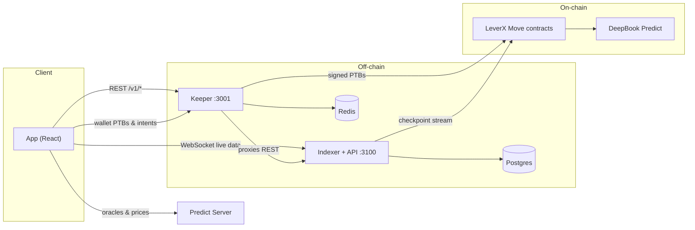
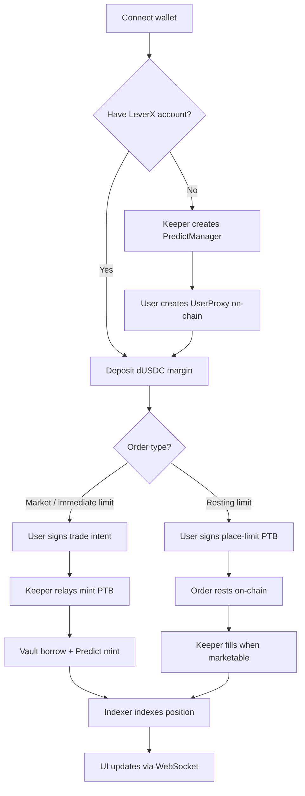
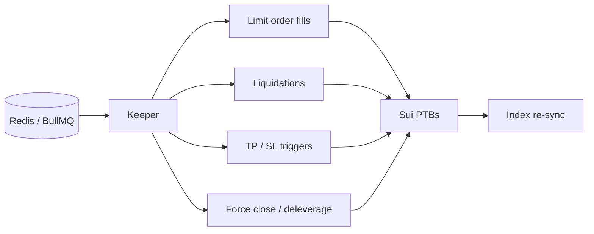

# LeverX

**Leveraged trading on DeepBook Predict** — open UP, DOWN, and RANGE positions with 1×–10× leverage on Sui testnet.

LeverX sits between traders and [DeepBook Predict](https://docs.sui.io/onchain-finance/deepbook-predict/deepbook-predict): you post dUSDC margin, borrow from a shared vault, and mint binary options through your own proxy account. A keeper bot handles liquidations, limit fills, and trade relay; an indexer streams on-chain state into the UI.

---

## How it fits together



| Piece | What it does |
|-------|----------------|
| **App** | Trading terminal, portfolio, vault, leaderboard |
| **Indexer** | Reads Sui checkpoints → Postgres; serves REST + WebSocket |
| **Keeper** | Trade relay, limit fills, liquidations, triggers, force-close |
| **Contracts** | Vault borrow, user proxies, Predict mint/redeem wrappers |

---

## Opening a trade (happy path)



---

## Quick start

Pick the path that matches what you want to run.

### Option A — Frontend only (fastest)

Use the hosted indexer and keeper. Good for UI work — no Docker required.

**Prerequisites:** [Bun](https://bun.sh) or Node.js 20+

```bash
# 1. Clone and enter the app
cd app

# 2. Point at hosted backends (testnet contract IDs are already in the file)
cp .env.example .env

# 3. Install dependencies
bun install    # or: npm install

# 4. Start the dev server
bun dev        # or: npm run dev
```

Open the URL printed in the terminal (usually `http://localhost:8080`).

**Optional:** Google sign-in needs Enoki keys in `.env`:

```env
VITE_ENOKI_API_KEY=...
VITE_ENOKI_GOOGLE_CLIENT_ID=...
```

---

### Option B — Full local stack (app + indexer + keeper)

Run Postgres, Redis, indexer, and keeper together with Docker, then point the app at localhost.

**Prerequisites:** Docker, Bun or Node.js 20+

```bash
# 1. Configure the keeper signer
cp keeper/.env.example keeper/.env
# Edit keeper/.env — set KEEPER_PRIVATE_KEY

# 2. Start Postgres, Redis, indexer, and keeper
docker compose up --build
```

Wait until the keeper health check passes (`curl http://localhost:3001/health`).

```bash
# 3. Configure the app for local backends
cd app
cp .env.example .env
```

In `app/.env`, uncomment the local URLs:

```env
VITE_LEVERX_KEEPER_URL=http://localhost:3001
VITE_LEVERX_INDEXER_URL=http://localhost:3100
VITE_LEVERX_INDEXER_WS_URL=ws://localhost:3100/v1/ws
```

```bash
# 4. Install and run
bun install
bun dev
```

> **Note:** Keeper proxies REST `/v1/*` only. WebSocket streams must hit the indexer directly (`:3100`).

See [`docker/leverx-stack/README.md`](docker/leverx-stack/README.md) for ports and build details.

---

### Option C — Individual services (advanced)

| Service | Docs | Typical command |
|---------|------|-----------------|
| Contracts | [`contracts/README.md`](contracts/README.md) | `cd contracts && sui move build` |
| Indexer | [`indexer/README.md`](indexer/README.md) | `cargo run -p leverx-indexer` + `cargo run -p leverx-server` |
| Keeper | [`keeper/README.md`](keeper/README.md) | `cd keeper && pnpm install && pnpm run start:dev` |
| App | below | `cd app && bun dev` |

After republishing contracts, resync the indexer:

```bash
bash indexer/scripts/reset-from-publish.sh
```

---

## Build for production

```bash
cd app
bun run build    # or: npm run build
bun run preview  # optional local preview of the production build
```

---

## Project structure

```
leverx/
├── app/           # TanStack Start UI — markets, trading, portfolio, vault, points
├── contracts/     # Move smart contracts (leverage vault, proxy PredictManager)
├── indexer/       # On-chain indexer (order book, positions, limits, leaderboard)
├── keeper/        # HTTP API — trade relay, manager relay, BullMQ maintenance
└── docker/        # Combined indexer + keeper image
```

---

## App pages

| Route | What you'll find |
|-------|------------------|
| `/` | Landing page |
| `/markets` | Market list with live oracle feed |
| `/predictions/:oracleId` | Trading terminal — chart, order book, leverage panel |
| `/portfolio` | Balances, open trades, limit orders |
| `/vault` | Shared dUSDC pool — deposit, withdraw, APR |
| `/points` | Genesis volume leaderboard |
| `/guide` | How it works |
| `/terms` | Terms of service |
| `/privacy` | Privacy policy |

### Data sources

- **Predict Server** (`https://predict-server.testnet.mystenlabs.com`) — oracles, spot/forward prices, SVI params, vault TVL
- **LeverX indexer** — order book, resting limits, positions, liquidations, points
- **Keeper** — trade relay (`POST /trade/mint`, `/trade/redeem`), manager onboarding (`POST /create-manager`)

Environment variables: see [`app/.env.example`](app/.env.example).

---

## Keeper maintenance loop



Scheduled jobs run through BullMQ on Redis — not in-process cron. See [`keeper/README.md`](keeper/README.md) for task kinds and env vars.

---

## Tech stack

| Layer | Stack |
|-------|-------|
| **App** | TanStack Start/Router, React 19, Tailwind CSS v4, TanStack Query, lightweight-charts |
| **Indexer** | Rust, Diesel, `sui-indexer-alt-framework` |
| **Keeper** | NestJS, BullMQ, `@mysten/sui` |
| **Chain** | Sui testnet, DeepBook Predict (`predict-testnet-4-16`), Pyth (cross-collateral) |

---

## Contract upgrades

When contracts, indexer, or app change together, resync the indexer after republish and align env vars across services.

| Change | What to know |
|--------|----------------|
| `liquidation_bps` on registry | UI health labels use `protocol.liquidation_bps` (default 9500 bps) |
| `trading_paused` | New opens blocked; close, repay, and settle still work |
| `remintAfterDeleverage` on mint | Toggle in leverage panel (default on for >1×) |
| Liquidation `event_kind` | Portfolio shows liquidated / force-deleveraged / bad-debt rows |
| Range permissionless settle | Binary settle works; range may fail until Predict adds permissionless range redeem |

PTB builders in the app do not call `vault_flash::repay_flash_liquidity` — that is keeper-only.

---

## Further reading

- [`contracts/README.md`](contracts/README.md) — Move modules and transaction model
- [`indexer/README.md`](indexer/README.md) — API endpoints, WebSocket channels, tables
- [`keeper/README.md`](keeper/README.md) — HTTP API, Redis, liquidation logic
- [`docker/leverx-stack/README.md`](docker/leverx-stack/README.md) — Docker ports and ops notes
